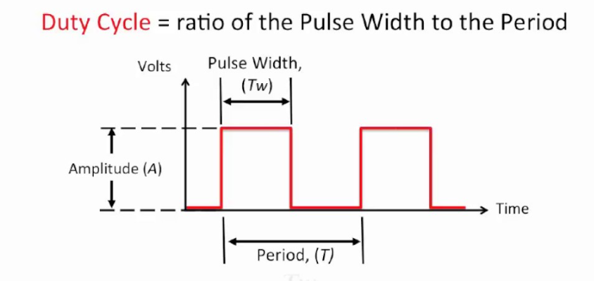
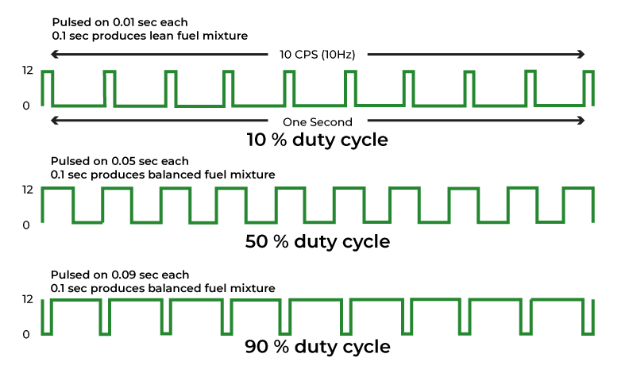
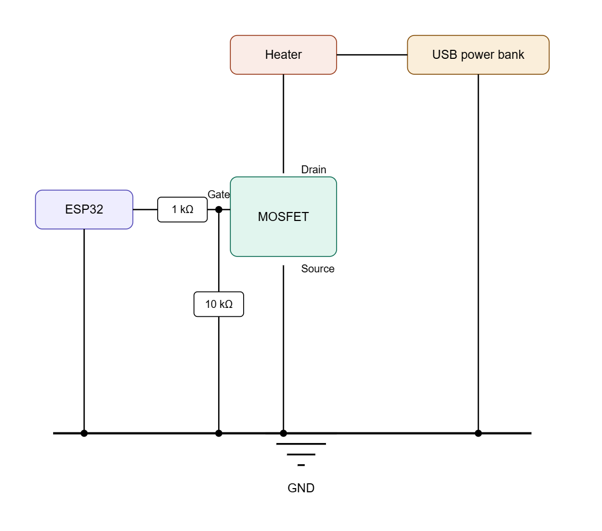
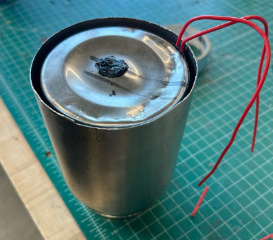
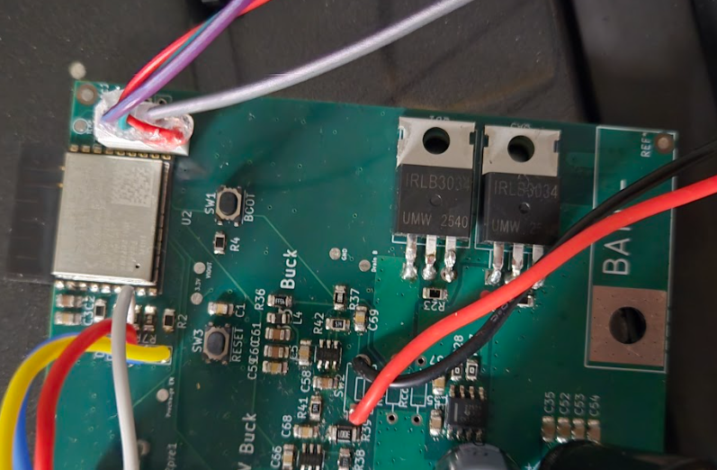

# N-channel MOSFET On/Off Programming For Heating using PWM (Pulse Width Modulation)
Aditi Verma ECE 196 SP26
## Table of Contents

- [Abstract](#abstract)
- [Introduction](#introduction)
- [Build Guide](#build-guide)
- [Code Snippet](#code-snippet)
- [How To Run](#how-to-run)
- [Debugging](#debugging)
- [Connection To Final Project](#connection-to-final-project)
- [Resources](#resources)
- [AI Disclosure](#ai-disclosure)
---

## Abstract
This tutorial covers the basics of ESP32's built in pulse width modulation(PWM), N-channel MOSFET, and goes over how to control the power output of a supply such as battery or USB port bank using PWM duty cycles all to achieve the goal of powering a heating element that can do numerous heating related things.

## Introduction
#### Pulse Width Modulation
Pulse Width Modulation (PWM) is a process of continuously switching signal HIGH (on) and LOW (off) instead of constantly keeping them HIGH or LOW.
The duty cycle (D) determines how long the signal is HIGH.


| Duty Cycle Definition | Varying Duty Cycles |
| :---: | :---: |
|  |  |
| **Tw** = Pulse Width<br>**T** = Period, time for one ON to OFF cycle <br>*Credit:* [YouTube](https://www.youtube.com/watch?v=ERMAPLVG8Z8)| *Credit:* [GeeksforGeeks](https://www.geeksforgeeks.org/electrical-engineering/duty-cycle/) |
| | |

#### Average Power
The power output is only active when the signal is at HIGH. If we decreace the duty cycle, the duration of the signal at HIGH will decrease, causing a lower power output. <br>
In terms of the average power equation, a duty cycle of 50% with a supply of 50V and 50 ohm resistance will result in

$$
\begin{aligned}
P_{average} &= D \cdot (V^{2} / R) \\
P_{average} &= 0.50 \cdot (50^{2} / 50) \\
P_{average} &= 25 \text{ W}
\end{aligned}
$$

If we set the duty cycle to 100% then we would get a power output of 50W instead. 
<hr>

#### N-Channel MOSFET

We will be using an N-channel MOSFET (Metal-Oxide-Semiconductor Field-Effect Transistor) as a way to pass voltage since the ESP32 can only output 3.3V which is not enough for most heating elements. 

A typical N-channel MOSFET has...
- G (Gate): Controls the ON/OFF state (driven by ESP32) 
- D (Drain): Connects to the load (connected to the source/battery) 
- S (Source): Connects to the ground


**An N-channel MOSFET has an arrow that points into the gate which indicates that current can only flow from drain to source
<hr>

#### ESP32 LEDC PWM Channel
  
  An LEDC PWM channel is an internal software/hardware resource inside the ESP32 that generates the PWM signal.

  ESP32 has 16 PWM channels, each channel has:
  - Frequency (Hz)
  - Resolution (bits) — determines how finely you can set duty cycle
  - Duty value — integer from 0 to 2^resolution−1

  So with a typical 8-bit resolution, we would have a duty range from 0-255 where 128 would indicate a 50% duty value.

## Build Guide

List of materials:
- ESP32 from Mini Project #2
- N-channel MOSFET (3.3V compatible)
- Resistive heating element, rated 5W
- 1 kΩ resistor 
- 10 kΩ resistor
- USB power (output 5V)

Assembly:

Generated by claude


## Code Snippet

The code will be written on Arduino IDE.

```cpp
const int PWM_PIN = 25; // ESP32 pin driving MOSFET gate
const int PWM_CHANNEL = 0; // LEDC channel (0–15)
const int PWM_FREQ = 1000; // 1 kHz
const int PWM_RES = 8; // duty values 0–255

void setup() {
  Serial.begin(115200);

  // Configure LEDC PWM channel
  ledcSetup(PWM_CHANNEL, PWM_FREQ, PWM_RES);

  // Attach the channel to the ESP32 pin
  ledcAttachPin(PWM_PIN, PWM_CHANNEL);

  // Start at 0% duty (heater off)
  ledcWrite(PWM_CHANNEL, 0);

  // Ask for user input on desired duty value
  Serial.println("Enter a duty value (0-255):");
}

void loop() {
  if (Serial.available() > 0) {
    int dutyValue = Serial.parseInt();

    if (dutyValue < 0 || dutyValue > 255) {
      Serial.println("Invalid input. Please enter a value between 0 and 255.");
      return;
    }

    ledcWrite(PWM_CHANNEL, dutyValue);

    float dutyCyclePercent = (dutyValue / 255.0) * 100.0;
    float voltage = 5.0;
    float resistance = 10.0;
    float avgPower = (dutyValue / 255.0) * (voltage * voltage / resistance);

    Serial.print("Duty Value: ");
    Serial.print(dutyValue);
    Serial.println("/255");
    Serial.print("Duty Cycle: ");
    Serial.print(dutyCyclePercent, 1);
    Serial.println("%");
    Serial.print("Avg Power: ");
    Serial.print(avgPower, 3);
    Serial.println(" W");
  }
}

```

## How to run

Upload and Test

- Connect your ESP32 via USB
- In Arduino IDE: `Tools` -> `Board` -> `ESP32 Dev Module`, select the correct port
- Click upload
- Open Serial Monitor at 115200 baud
- Type 50 and press `Enter`. Heater runs at 50% power
- Type 0 = heater off

## Debugging
1. Make sure to set serial port to 115200 baud
2. If nothing happens when duty cycle changes, make sure the pin number is the same one as the ESP32
3. Make sure MOSFET drain is connected to the power supply and source is to ground
4. Measure voltage at gate pin to ensure voltage is correct (V_gate = Duty cycle * 3.3V)

## Connection to final project

The N-channel MOSFET heating control is a key element of our self-heating thermos final project. In our project, we have 4 N-channel MOSFETs that are controlled by the ESP32. The ESP32 first reads the thermos temperature before deciding how much heat to generate by adjusting the PWM duty cycle. It is important to have control over how much power is delivered to the heating element since different amounts of heat are required depending on whether we are raising the temperature to boiling or merely maintaining the current temperature of the liquid.

| Thermos with heating element | ESP32 and MOSFETS |
| :---: | :---: |
|  |  |

## Resources

#### Related Classes at UCSD
- ECE 35: Circuit analysis, average power, Ohm's Law
- ECE 65: MOSFETs, transistor switching, gate drive

| Topic | Link |
| :---: | :---: |
| Basics of PWM | https://docs.arduino.cc/learn/microcontrollers/analog-output/ |
|N-channel MOSFET | https://youtu.be/ArH33idCHOc?si=Ju902VXtIVteLEPK |
|ESP32 LEDC PWM docs | https://docs.espressif.com/projects/esp-idf/en/latest/esp32/api-reference/peripherals/ledc.html |
| Arduino ledcSetup reference| https://espressif-docs.readthedocs.io/en/latest/ |

### AI-use disclosure

Claude

- Helped generate the circuit in "Build Guide" section. I told claude descriptions of all the connections so it could create a visual for it
- I asked claude about basics on N-channel MOSFETS and the diode that exists in the body of the transistor. I also just asked other basic questions like what amount of voltage do we need for the supply or the resistor rating
- I also asked markdown syntax like how to create tables, how to use latex for equations, and how to change the size of images
- Debugged my code and got help understanding how LEDC PWM works with ESP32

